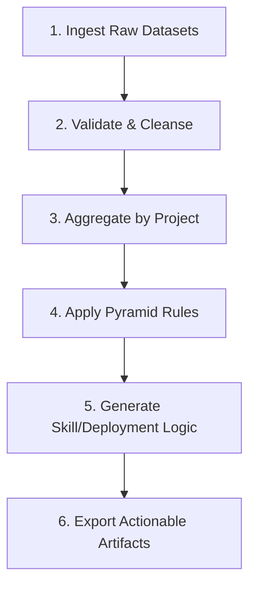

# 🚀 Fresher Deployment Agent (FDA)
*An AI-Driven Workforce Pyramid Optimization & Analytics Platform*

---

## 📑 1. Executive Summary
The **Fresher Deployment Agent (FDA)** is a specialized, automated pipeline and analytics dashboard designed for IT service organizations. It bridges the gap between raw HR/Operations data and actionable resource management. By analyzing headcount distributions and project skill requirements, FDA identifies structurally imbalanced projects and prescribes exact deployment strategies for entry-level talent (Freshers).

This document serves as a comprehensive guide to the project's background, technical architecture, and business value, structured to easily translate into a formal presentation.

---

## 🛑 2. The Business Problem

In enterprise IT service and consulting firms, profitability is directly tied to the "Workforce Pyramid"—the ratio of Junior, Mid-level, and Senior resources on a project. 

**The Current State:**
1. **Top-Heavy Pyramids:** Projects naturally experience "grade creep." Without strict oversight, projects accumulate too many Mid and Senior-level resources.
2. **Margin Erosion:** A top-heavy project drastically increases the average cost of delivery, directly cutting into profit margins.
3. **The "Bench" Problem:** Organizations hire thousands of freshers (campus recruits), but Resource Managers (RMs) struggle to deploy them because they lack visibility into *which* projects are structurally ready to absorb them and *what* skills are required.
4. **Manual Overhead:** RMs currently spend weeks manually cross-referencing massive, messy Excel dumps (Headcount reports vs. Demand reports) to make deployment decisions.

---

## 🎯 3. The Objective & The "Target Pyramid"

The primary goal of FDA is to enforce a **Healthy Target Pyramid**:
*   **79% Junior (Freshers)**
*   **20% Mid-Level**
*   **1% Senior-Level**

**The Mission:**
Automate the analysis of current project structures, flag deviations from the 79/20/1 target, and provide deterministic, data-backed recommendations on exactly how many freshers to deploy to restore health—including the required training curriculums.

---

## 🧠 4. The Solution: How FDA Works

FDA replaces manual spreadsheet crunching with a deterministic, algorithmic pipeline. It consists of a robust backend data-engine and a blazing-fast React dashboard. 

Instead of just showing historical data, FDA acts as a **prescriptive engine**:
1. It calculates the exact numeric "Gap" in Junior headcount.
2. It cross-references that gap with the project's open technical requirements.
3. It generates an immediate "Suggested Intake" number.
4. It tells the training department exactly which curriculum (e.g., "React + Node", "Java Springboot") the freshers need before deployment.

---

## ⚙️ 5. Deep Dive: The Agentic Workflow (Pipeline)

The core logic is executed via a single backend pipeline (`POST /run-pipeline`). 

*   **Step 1: Ingestion.** The pipeline reads raw enterprise data extracts. Namely, **RIS data** (Resource Information System - current headcount) and **SO data** (Service Orders - technical skill demands).
*   **Step 2: Validation.** Normalizes erratic column naming conventions, strips missing values, and enforces strict type checking using Pandas.
*   **Step 3: Aggregation.** Groups thousands of individual employee records by `projectId` to establish the baseline headcount structure.
*   **Step 4: The Rules Engine.** Compares the baseline against the `79/20/1` target. It tags projects with boolean flags like `lowJuniorWarning`, `overIndexedMid`, and `overIndexedSenior`.
*   **Step 5: Skill Mapping.** Analyzes the SO data to find the most demanded skills for a given project, mapping them to predefined Training Tracks. It calculates a `Readiness Score` based on whether the project has enough Senior oversight to actually train the incoming freshers.
*   **Step 6: Export.** The backend does not return massive JSON payloads. Instead, it writes the finalized intelligence into two master Excel files (`pyramid_report.xlsx` and `suggestions_report.xlsx`) and returns their file paths to the frontend.

---

## 🏗️ 6. Technical Architecture

The system utilizes an innovative **Frontend-Heavy Analytics Architecture** to maximize performance and minimize server costs.

### The Backend (Python / FastAPI / Pandas)
*   **Stateless Data Engine:** The backend is purely responsible for number-crunching. It executes the Pandas pipeline and saves the files to an `/outputs` directory.
*   **Single API Surface:** Exposes only one endpoint (`/run-pipeline`), ensuring the backend remains incredibly lightweight and easy to maintain.

### The Frontend (React / Vite / TailwindCSS / Recharts)
*   **Zero-API-Bloat:** Rather than making dozens of API calls for different charts, the React frontend uses the `fetch` API to download the generated Excel reports directly.
*   **In-Browser Processing:** Utilizing `xlsx` (SheetJS), the frontend parses the Excel sheets into JSON directly within the user's browser RAM.
*   **Instant Interactivity:** Because all data is stored in local React state, filtering, switching tabs, and rendering charts (via Recharts) happens instantly with zero network latency.

---

## 🖥️ 7. Core Dashboard Features (The UI Experience)

The FDA frontend is designed as a premium, dark-themed, "Control Center" for Resource Managers. 

### A. Real-Time Summary Metrics
*   **Imbalance HC %:** The percentage of total headcount currently sitting in "unhealthy" projects.
*   **Avg Junior %:** The macro view of the organization's entry-level ratio.
*   **Alerts & Freshers Needed:** Immediate quantitative KPIs.

### B. Tabular Analysis Views
*   **Overview Tab:** Houses the full `Pyramid Table`, displaying every project with visual, color-coded progress bars for Junior/Mid/Senior ratios.
*   **Suggestions Table:** Provides a filtered view of projects ready for intake. Features a `Readiness Score` slider and real-time keyword search for specific skills.

### C. Visual Analytics (Charts)
*   **Fresher Allocation Chart:** A bar chart ranking the top 10 projects by suggested fresher intake.
*   **Gap Severity Distribution:** Groups projects into severity buckets (e.g., 0-10, 11-20, 40+ gap) to visualize the scale of the imbalance.
*   **Mid vs Senior Scatter Plot:** Plotted coordinates for every project to instantly identify outliers in the "expensive" (high mid/high senior) quadrant.

### D. Actionable Alerts Panel
*   Replaces basic lists with grouped, tabular alerts separated by violation type (*Low Junior Ratio*, *Over-Indexed Senior*, etc.).
*   Features automatic **Severity Badging** (High/Medium/Low) and expandable rows that provide plain-English "Fix Hints" (e.g., *"Roll off seniors to other projects"*).

### E. Deep-Dive Modals
*   Clicking any project opens a unified modal displaying exactly *why* the project was flagged and the exact training curriculum recommended for new deployments.

---

## 📈 8. Business Value & ROI

Implementing the FDA system yields immediate organizational benefits:

1. **Margin Restoration:** By proactively identifying and fixing top-heavy projects, average billing costs decrease.
2. **Accelerated Fresher Deployment:** Bench time for new campus recruits is drastically reduced because the system explicitly maps freshers to projects that actually need them.
3. **Demand-Driven Training:** Training departments no longer guess what technologies to teach. FDA dictates exactly which skills are missing on imbalanced projects, allowing for just-in-time, highly targeted training.
4. **Massive Time Savings:** What previously took a team of Resource Managers days of pivot-table manipulation is now achieved with a single click of the "Run Pipeline" button.

---

## 🚀 9. Future Roadmap
*   **Live HRIS Integration:** Replacing static Excel ingestion with live API hooks into Workday/SAP.
*   **Predictive Forecasting:** Implementing ML models to predict when a healthy project is likely to drift into an imbalanced state based on historical attrition rates.
*   **Automated Deployment Execution:** Integrating with internal bench management tools to automatically reserve available freshers for the highest-priority projects.
