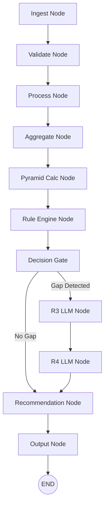

# 🚀 Fresher Deployment Agent (FDA) - LangGraph Edition

FDA is a production-grade **Decision Intelligence System** that leverages **LangGraph** and **Groq-powered LLMs** to automate IT resource management. It analyzes team pyramids, calculates deployment readiness, and generates intelligent training recommendations for fresher intake.

---

## 🏗️ System Architecture

The project has been refactored into a state-driven **LangGraph** architecture, separating data processing, business logic, and AI reasoning into modular nodes.



---

## 🛠️ Tech Stack

*   **Orchestration**: [LangGraph](https://github.com/langchain-ai/langgraph) for state-managed workflows.
*   **LLM Intelligence**: [Groq](https://groq.com/) (Llama 3.1 8B Instant) for high-speed skill analysis.
*   **API Framework**: [FastAPI](https://fastapi.tiangolo.com/) for serving the pipeline.
*   **Data Processing**: [Pandas](https://pandas.pydata.org/) for high-performance Excel manipulation.
*   **Parsing**: [Pydantic](https://docs.pydantic.dev/) for strict JSON schema enforcement via Structured Outputs.

---

## 📂 Project Structure

*   **`fda/`**: Core package containing logic.
    *   **`graph/`**: The core graph definition and orchestration nodes.
    *   **`engine/`**: Business logic for pyramid rules and deployment math.
    *   **`llm_agents.py`**: Groq-powered agents for skill suitability (R3) and training design (R4).
    *   **`exporter.py`**: Excel report generation logic.
    *   **`test.py`**: Consolidated test suite.
*   **`main.py`**: FastAPI server exposing the `/run-pipeline` endpoint.

---

## 🚦 Getting Started

### 1. Prerequisites
*   Python 3.10+
*   Groq API Key (Sign up at [Groq Cloud](https://console.groq.com/))

### 2. Installation
```bash
# Activate your environment
.\myenv\Scripts\activate

# Install dependencies
pip install -r requirements.txt
```

### 3. Environment Configuration
Create a `.env` file in the root directory:
```env
GROQ_API_KEY=your_groq_api_key_here
```

### 4. Running the Pipeline
Start the FastAPI server:
```bash
uvicorn main:app --port 8010 --reload
```
Open your browser to `http://127.0.0.1:8010/docs` to execute the pipeline via the Interactive Swagger UI.

---

## 📊 Outputs

The agent generates two timestamped reports in the `output/` folder:

1.  **`FDA_PyramidReport_YYYYMMDD_HHMMSS.xlsx`**: Detailed health check of project pyramids, showing junior %, gaps, and triggered rule flags (R1/R2).
2.  **`FDA_Suggestions_YYYYMMDD_HHMMSS.xlsx`**: AI-driven deployment readiness scores and customized training curriculums for every project.

---

## 📝 Business Logic (Rules)

*   **R1 (Low Junior Warning)**: Triggers if a project has less than 20% juniors.
*   **R2 (Over-Indexed Mid)**: Triggers if a project has more than 50% mid-level resources.
*   **Deployment Readiness Score**: A weighted calculation (40% Gap, 30% Skill Match, 20% Team Size, 10% Role Match).

---
*Developed for Fresher Deployment Optimization.*
